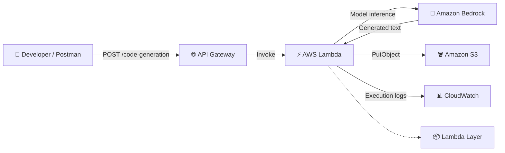
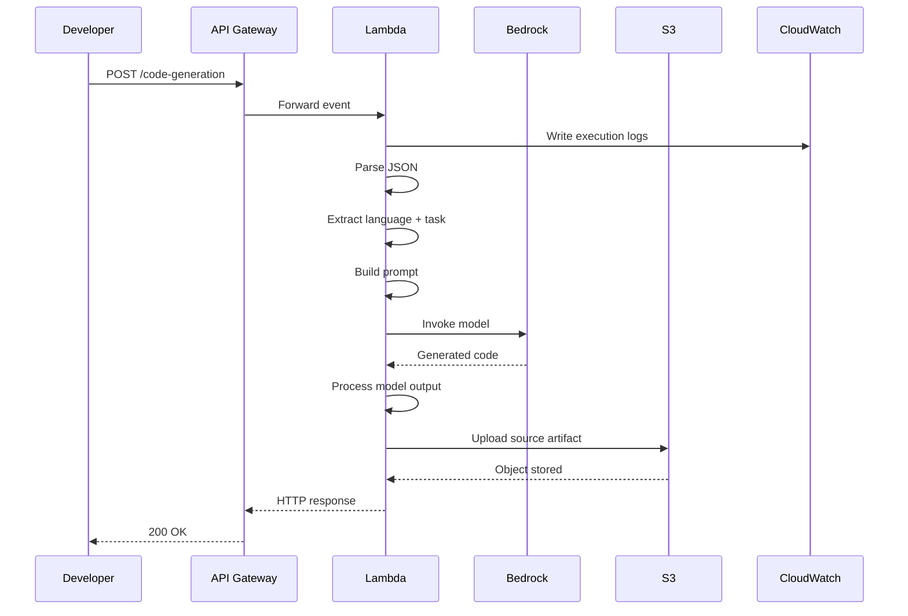
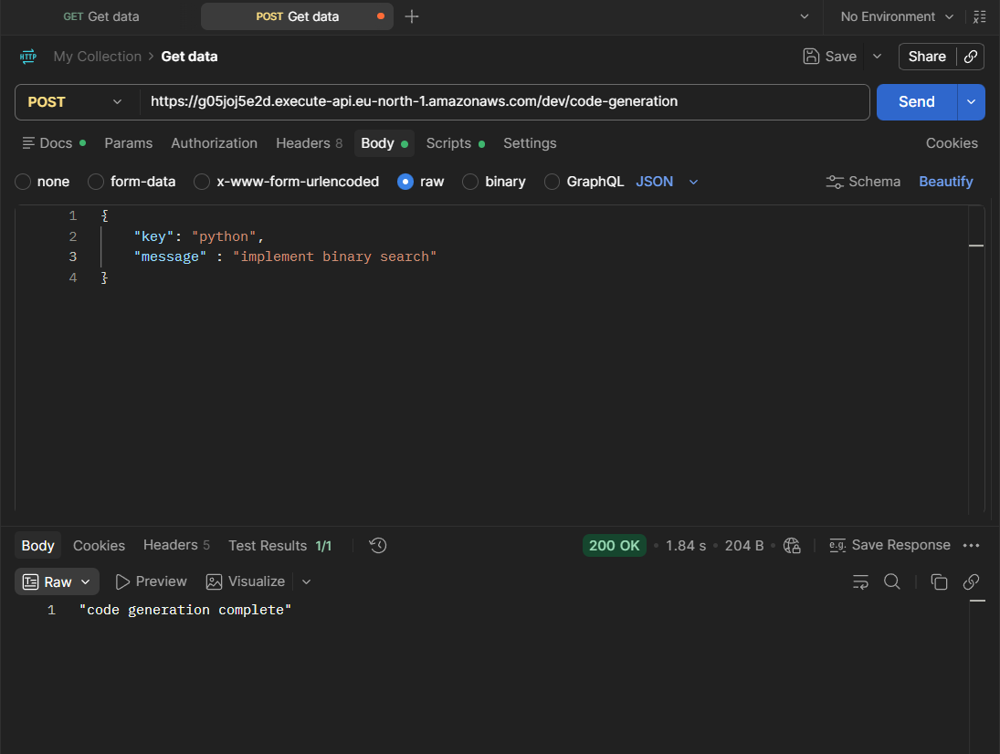
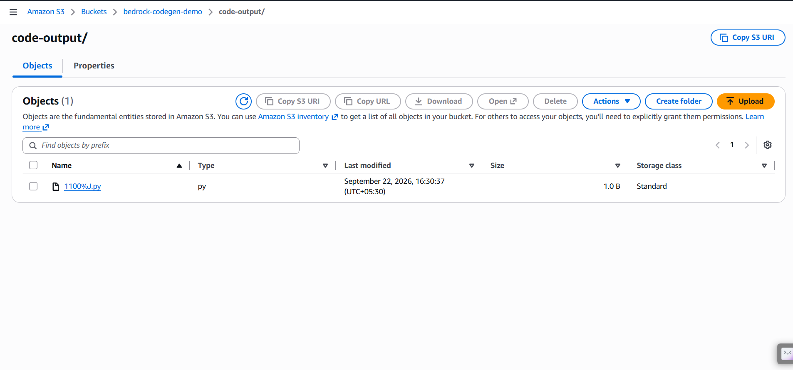
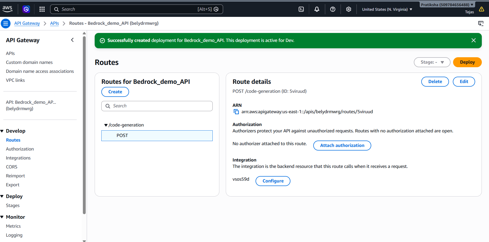
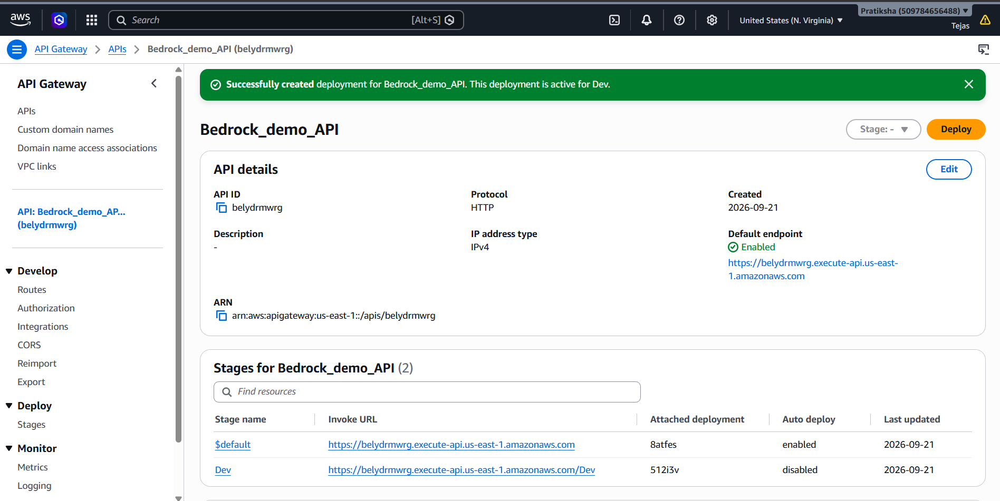
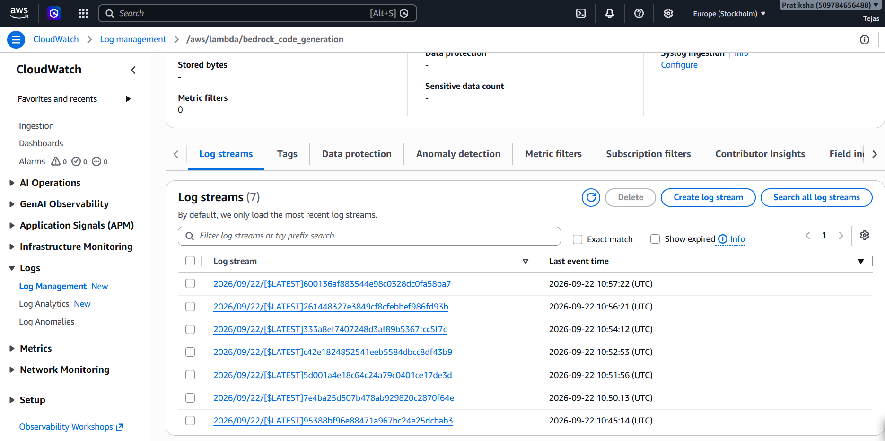
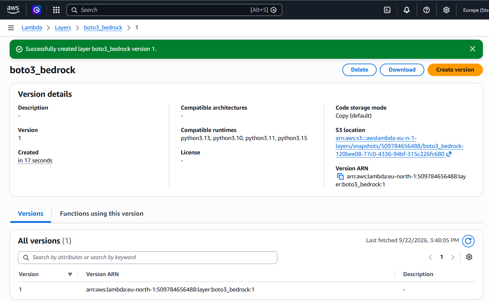
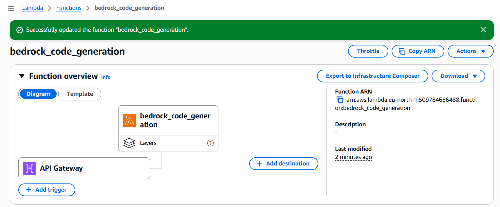
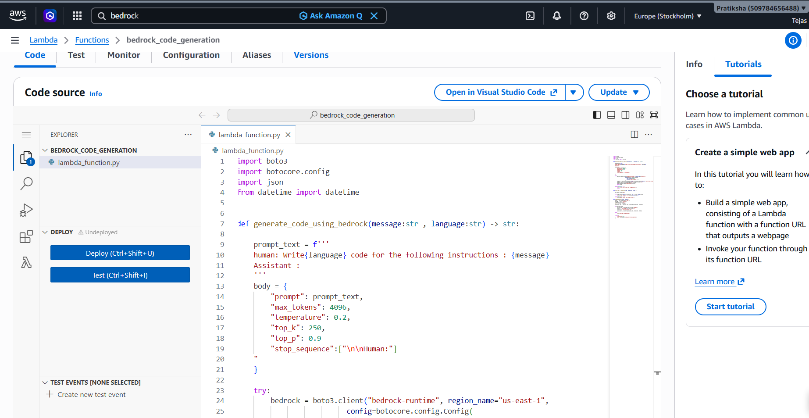

# ⚡ Serverless AI Code Generator

### Natural language → Amazon Bedrock → source code → Amazon S3

A portfolio-grade **serverless Generative AI backend** built with AWS. The application accepts a programming requirement through an HTTP API, invokes a foundation model through **Amazon Bedrock**, processes the generated response in **AWS Lambda**, and stores the resulting source-code artifact in **Amazon S3**.

> **Project type:** Cloud AI / Generative AI / Serverless  
> **Status:** Working development prototype  
> **Primary language:** Python

---

## 🧭 At a Glance

| Layer | AWS / Tool | Role |
|---|---|---|
| Client | Postman | Sends the coding request |
| API | Amazon API Gateway | Exposes `POST /code-generation` |
| Compute | AWS Lambda | Orchestrates the workflow |
| AI | Amazon Bedrock | Generates source code |
| Storage | Amazon S3 | Persists generated code |
| Observability | Amazon CloudWatch | Captures execution logs |
| Runtime dependencies | Lambda Layer | Packages required Python dependencies |
| SDK | Boto3 | Calls AWS services from Python |

---

## 🎬 The Idea

Instead of asking a developer to manually interact with a model, the project wraps the model behind a cloud API:

```text
┌──────────────┐
│   Developer  │
│  / Postman   │
└──────┬───────┘
       │
       │ POST /code-generation
       ▼
┌─────────────────────┐
│   API Gateway       │
│   HTTP API          │
└──────────┬──────────┘
           │
           ▼
┌─────────────────────┐
│      Lambda         │
│  Request + Prompt   │
│    Orchestration    │
└───────┬───────┬─────┘
        │       │
        │       └───────────────┐
        ▼                       ▼
┌───────────────┐        ┌──────────────┐
│ Amazon        │        │ Amazon S3    │
│ Bedrock       │        │ code-output/ │
│ GenAI         │        │ *.py         │
└───────┬───────┘        └──────────────┘
        │
        │ generated code
        └──────────► Lambda

                 ┌──────────────┐
                 │ CloudWatch   │
                 │ Logs         │
                 └──────────────┘
```

The important architectural idea is the separation of responsibilities:

**API Gateway exposes → Lambda orchestrates → Bedrock generates → S3 persists → CloudWatch observes.**

---

# 🏗️ Architecture



### Detailed architecture documentation

- [System architecture](architecture/architecture.md)
- [Architecture diagram source](architecture/diagrams/system-architecture.mmd)
- [Request lifecycle](architecture/diagrams/request-lifecycle.mmd)
- [Deployment flow](architecture/diagrams/deployment-flow.mmd)

---

# 🔄 End-to-End Workflow



### Request lifecycle

```text
1. Client sends JSON
        ↓
2. API Gateway receives HTTP POST
        ↓
3. API Gateway invokes Lambda
        ↓
4. Lambda parses the event
        ↓
5. Lambda builds the Bedrock prompt
        ↓
6. Bedrock generates source code
        ↓
7. Lambda extracts the generated text
        ↓
8. Lambda writes the artifact to S3
        ↓
9. Lambda returns an API response
        ↓
10. CloudWatch retains execution logs
```

Full explanation: [docs/workflow.md](docs/workflow.md)

---

# 🧪 API

### Route

```http
POST /code-generation
```

### Example request

```json
{
  "key": "python",
  "message": "implement binary search"
}
```

### Meaning

| Field | Purpose |
|---|---|
| `key` | Target programming language |
| `message` | Natural-language programming requirement |

### Observed test result

The supplied Postman evidence shows:

```text
200 OK
```

with:

```json
"code generation complete"
```

See the actual test screenshot:



More details: [API contract](api/api-contract.md)

---

# 🧠 How the AI Layer Works

The Lambda function creates a prompt using the requested language and coding instruction.

The visible implementation follows the general pattern:

```text
human: Write <language> code for the following instruction:
<message>
Assistant:
```

The model request is then sent through the **Bedrock Runtime** API.

Conceptually:

```python
prompt = build_prompt(language, message)

response = bedrock_runtime.invoke_model(
    modelId=MODEL_ID,
    body=request_body
)

generated_code = extract_model_output(response)
```

The exact model request schema is model-specific, so the repository intentionally keeps that implementation detail tied to the deployed function rather than inventing a different model contract.

See:

- [Prompt design](bedrock/prompt-design.md)
- [Model invocation](bedrock/model-invocation.md)

---

# ⚡ Lambda: The Orchestrator

Lambda is the central control point.

Its job is to connect the individual services:

```text
HTTP Event
   ↓
Parse request
   ↓
Extract language + message
   ↓
Build prompt
   ↓
Call Bedrock
   ↓
Read generated response
   ↓
Create output artifact
   ↓
Upload to S3
   ↓
Return HTTP response
```

This makes Lambda the **application orchestration layer**, not the AI model itself.

That distinction matters:

> Lambda does not "become" the AI. It coordinates the request, AI inference, storage, and response.

---

# 🪣 Generated Code in S3

The project stores generated artifacts under:

```text
code-output/
```

During testing, an object appeared in the bucket:

```text
code-output/1100%.py
```



### Why S3?

S3 gives the generated code a durable location outside the Lambda execution environment.

That enables future functionality such as:

- downloading generated files
- keeping generation history
- storing metadata
- versioning artifacts
- building a code-generation dashboard
- integrating generated files into CI/CD workflows

More: [S3 storage design](s3/storage-design.md)

---

# 🌐 API Gateway

The HTTP API exposes:

```text
POST /code-generation
```

and connects the route to the Lambda backend.



The deployment/stage configuration is also captured:



---

# 📊 Observability

The Lambda function writes execution information to CloudWatch:

```text
/aws/lambda/bedrock_code_generation
```



For serverless systems, this is crucial because there is no continuously running server terminal.

A useful debugging path is:

```text
Postman
   ↓
API Gateway
   ↓
Lambda logs
   ↓
Bedrock invocation
   ↓
Model response
   ↓
S3 upload
   ↓
S3 object content
```

More: [CloudWatch monitoring](monitoring/cloudwatch.md)

---

# 📦 Lambda Layer

The project uses a Lambda Layer named:

```text
boto3_bedrock
```

The captured AWS console shows version `1`.



The Lambda architecture view also shows an attached layer:



A layer keeps dependencies separate from the function's main source package and can simplify reuse and deployment.

---

# 🔐 IAM & Security

The architecture requires controlled permissions for:

```text
Lambda
 ├── CloudWatch Logs
 ├── Bedrock model invocation
 └── S3 object upload
```

The production principle should be:

> **Give the Lambda role only the permissions required for the operations it actually performs.**

Avoid broad permissions such as:

```text
Action: "*"
Resource: "*"
```

when a resource-specific permission is possible.

### Public-repository checklist

Before publishing:

- [ ] No AWS access keys
- [ ] No secret keys
- [ ] No `.env` files
- [ ] No bearer tokens
- [ ] No unnecessary account-sensitive screenshots
- [ ] IAM permissions reviewed
- [ ] S3 access restricted
- [ ] API authorization considered

See [IAM permissions](deployment/iam-permissions.md) and [Security](SECURITY.md).

---

# 🧪 Validation Strategy

A major lesson from the development process is that:

> **`200 OK` does not necessarily mean successful AI artifact generation.**

The system should be validated layer by layer.

| Check | Question |
|---|---|
| API | Did the request reach API Gateway? |
| Lambda | Was the function invoked? |
| Bedrock | Was the model actually invoked? |
| Response | Was generated text extracted correctly? |
| S3 | Was an object created? |
| Content | Does the object contain valid source code? |
| Logs | Can the complete execution be traced? |

This prevents a common debugging mistake: treating the API response as proof that every downstream operation succeeded.

---

# 🐛 Troubleshooting Journey

This project was developed iteratively.

The most useful debugging mindset was to break the pipeline into independent stages:

```text
          ┌──────────────┐
          │ API Gateway  │
          └──────┬───────┘
                 ↓
          ┌──────────────┐
          │    Lambda    │
          └──────┬───────┘
                 ↓
          ┌──────────────┐
          │   Bedrock    │
          └──────┬───────┘
                 ↓
          ┌──────────────┐
          │ Model Output │
          └──────┬───────┘
                 ↓
          ┌──────────────┐
          │     S3       │
          └──────────────┘
```

If something breaks, identify the first stage that fails instead of debugging the entire architecture at once.

See [Troubleshooting](docs/troubleshooting.md).

---

# 🌍 Region Configuration

The supplied development screenshots show resources in more than one AWS region, including:

```text
eu-north-1
us-east-1
```

This repository therefore treats the screenshots as **development evidence**, not as a single authoritative production-region diagram.

Before publishing the final implementation, verify that these resources are aligned as intended:

```text
Lambda
API Gateway
Bedrock Runtime
S3
Lambda Layer
```

The Bedrock model must also be available in the region where the runtime request is made.

---

# 📁 Repository Structure

```text
serverless-ai-code-generator/
│
├── README.md
├── LICENSE
├── SECURITY.md
├── PROJECT_NOTES.md
│
├── architecture/
│   ├── architecture.md
│   └── diagrams/
│       ├── system-architecture.mmd
│       ├── request-lifecycle.mmd
│       └── deployment-flow.mmd
│
├── api/
│   └── api-contract.md
│
├── bedrock/
│   ├── prompt-design.md
│   └── model-invocation.md
│
├── lambda/
│   └── lambda_function.py
│
├── s3/
│   └── storage-design.md
│
├── monitoring/
│   └── cloudwatch.md
│
├── deployment/
│   ├── deployment-guide.md
│   └── iam-permissions.md
│
├── docs/
│   ├── workflow.md
│   ├── troubleshooting.md
│   ├── future-improvements.md
│   └── github-presentation.md
│
└── screenshots/
    ├── aws/
    └── testing/
```

---

# 🛠️ Technology Stack

### AWS

`AWS Lambda` · `Amazon API Gateway` · `Amazon Bedrock` · `Amazon S3` · `Amazon CloudWatch` · `AWS IAM` · `Lambda Layers`

### Development

`Python` · `Boto3` · `JSON` · `HTTP` · `Postman`

### AI

`Generative AI` · `Foundation Models` · `Prompt Engineering` · `Code Generation`

---

# 🚀 Deployment Overview

The project can be assembled in this order:

```text
1. Create S3 bucket
       ↓
2. Prepare Lambda dependencies / layer
       ↓
3. Create Lambda function
       ↓
4. Configure IAM execution role
       ↓
5. Configure Bedrock access
       ↓
6. Create API Gateway HTTP API
       ↓
7. Add POST /code-generation
       ↓
8. Attach Lambda integration
       ↓
9. Deploy stage
       ↓
10. Test through Postman
       ↓
11. Verify CloudWatch
       ↓
12. Verify S3 artifact
```

See [Deployment Guide](deployment/deployment-guide.md).

---

# 🔭 Roadmap

### Phase 1 — Current prototype

- [x] HTTP API
- [x] Lambda backend
- [x] Bedrock integration
- [x] S3 output
- [x] CloudWatch logs
- [x] Postman testing
- [x] Lambda Layer

### Phase 2 — Production hardening

- [ ] Input validation
- [ ] Structured API responses
- [ ] Better file naming
- [ ] Authentication
- [ ] Least-privilege IAM
- [ ] Model configuration through environment variables
- [ ] Better error handling
- [ ] Code syntax validation

### Phase 3 — AI developer platform

- [ ] Multi-language generation
- [ ] Generation history
- [ ] DynamoDB metadata
- [ ] Web frontend
- [ ] Downloadable artifacts
- [ ] Code testing
- [ ] Security validation
- [ ] RAG over project documentation
- [ ] Repository-aware code generation
- [ ] Automated CI/CD integration

---

# 🧠 What I Learned From This Project

This project goes beyond calling an AI model.

It demonstrates the composition of several cloud capabilities:

```text
API Design
     +
Serverless Compute
     +
Generative AI
     +
Object Storage
     +
IAM
     +
Observability
     =
Cloud AI Application
```

The most important engineering lesson is that a GenAI application is a **system**, not just a prompt.

The model is one component. The surrounding API, compute, permissions, storage, error handling, monitoring, and validation determine whether the application works reliably.

---

# 💼 Portfolio Summary

### Short version

> **Serverless AI Code Generator** — Built a serverless Generative AI API using Amazon API Gateway, AWS Lambda and Amazon Bedrock to transform natural-language programming requirements into source code, with generated artifacts persisted to Amazon S3 and execution monitoring through CloudWatch.

### Interview version

> "I built a serverless AI code-generation backend. A client sends a programming request to an API Gateway HTTP endpoint. API Gateway invokes Lambda, which parses the request, constructs the Bedrock prompt, invokes the configured foundation model, processes the generated response, and stores the source artifact in S3. CloudWatch is used to trace and troubleshoot executions. I validated the complete flow using Postman and the AWS console."

---

# 📸 Deployment Evidence

## Lambda source



## API Gateway route


## API Gateway stages


## Lambda Layer


## S3 generated artifact


## CloudWatch


## Postman


## Lambda architecture


---

# 👨‍💻 Author

**Aditya Santosh Patil**

Computer Engineering · AI / Cloud AI Engineering

---

## ⭐ Project Philosophy

**Build the AI. Connect the cloud. Observe the system. Validate the result.**

