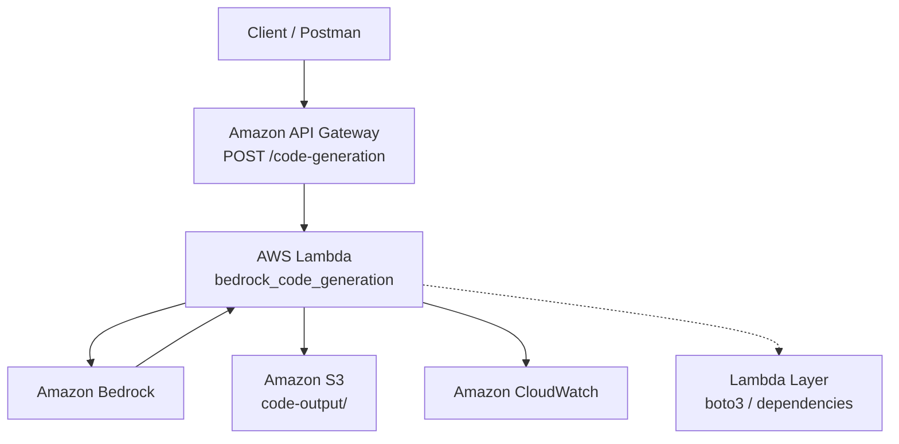

# Architecture

## High-level architecture

## Design principle

The architecture separates concerns:

- **API Gateway** handles HTTP exposure.
- **Lambda** orchestrates application logic.
- **Bedrock** performs generative AI inference.
- **S3** persists generated artifacts.
- **CloudWatch** provides observability.
- **IAM** controls service-to-service permissions.

This means the project does not need a permanently running backend server.
